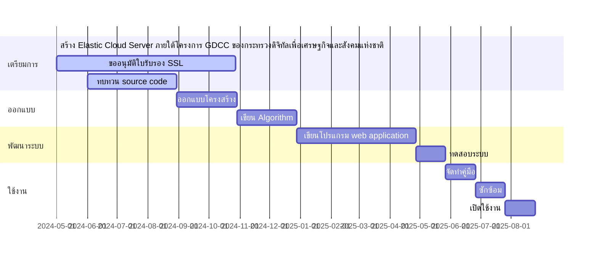
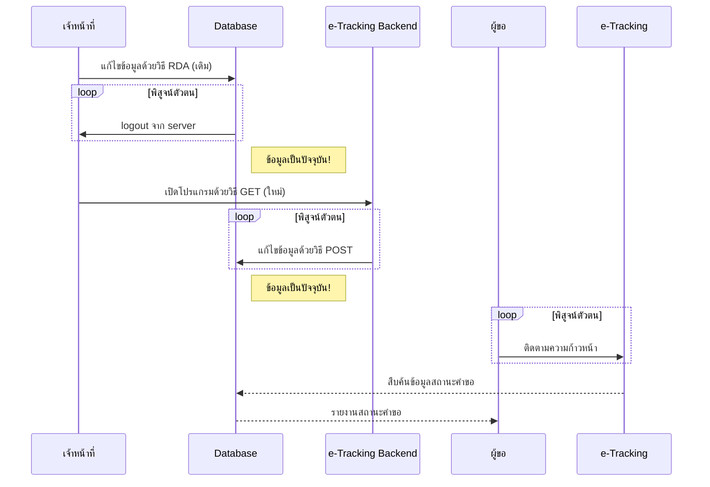

#  โครงการพัฒนาระบบ e-Tracking Backend
## หลักการและเหตุผล
เพื่อให้การแจ้งสถานะคำขอข้อมูลข่าวสารของสำนักงานปลัดกระทรวงทรัพยากรธรรมชาติและสิ่งแวดล้อม (สป.ทส.) ผ่านระบบ e-Tracking เป็นไปอย่างสะดวก รวดเร็ว ถูกต้อง และมั่นคงปลอดภัยมากขึ้น โดยไม่ต้องอาศัยนักพัฒนาระบบ (Developer) ในการเข้าถึงเครื่องแม่ข่ายจากระยะไกล (Remote Desktop Access: RDA) เพื่อแก้ไขรหัสในไฟล์ฐานข้อมูลที่ต้องใช้ทักษะความชำนาญด้าน coding และความละเอียดรอบคอบเป็นอย่างยิ่ง จำเป็นต้องมีระบบ backend สำหรับใช้ในการปรับปรุงฐานข้อมูลสถานะคำขอข้อมูลข่าวสารด้วยวิธีการใหม่ สป.ทส. จึงจัดทำโครงการนี้ในปีงบประมาณ พ.ศ. 2568 เพื่อพัฒนาระบบ e-Tracking Backend

## วัตถุประสงค์
1. พัฒนาระบบ e-Tracking Backend เป็นบริการดิจิทัล ประเภท Web Application
2. พัฒนาระบบจัดการสิทธิ์ผู้ใช้ โดยมีการแจ้งรหัสผ่าน OTP แก่ผู้ใช้งาน ทางอีเมล แบบอัตโนมัติ
   
## แผนการดำเนินงาน

## วิธีการดำเนินงาน
1. ทบทวน source code ของโปรแกรม e-Tracking ที่เชื่อมต่อกับระบบ e-Request
2. ออกแบบระบบดิจิทัล เพื่อรองรับการบริหารจัดการฐานข้อมูลและการบริการแจ้งสถานะคำขอผ่านระบบดิจิทัล ดังนี้

4. ออกแบบรายละเอียดของระบบ e-Tracking Backend โดยแสดง algorithm ของโปรแกรม เป็น flowchart
5. เขียนโปรแกรมคอมพิวเตอร์ในภาษา HTML/CSS/javaScript/PHP/Apps Script เพื่อสร้างระบบ e-Tracking Backend ในรูปแบบ Web Application ทำงานบน Elastic Cloud Server ภายใต้โครงการพัฒนาศูนย์ข้อมูลและระบบคลาวด์กลางภาครัฐ (Government Data and Cloud Center, GDCC)
6. ทดสอบระบบ โดยเจ้าหน้าที่ศูนย์บริการร่วม ทส. ที่มีหน้าที่เกี่ยวข้อง และใช้อีเมลของศูนย์บริการร่วม ทส. ในการ login
7. จัดทำคู่มือการใช้งาน
8. ซักซ้อมแนวทางปฏิบัติและเปิดใช้งาน ให้บริการแก่ประชาชนทุกรายที่ยื่นคำขอข้อมูลข่าวสารของ สป.ทส. ตั้งแต่ไตรมาสที่ 3 ปีงบประมาณ พ.ศ. 2568

## งบประมาณ
ค่าจัดซื้อใบรับรองความปลอดภัย Secure Socket Layer (SSL) อายุ 1 ปี วงเงิน 5,000 บาท
> [!NOTE]
> ไม่มีค่าจ้างที่ปรึกษาหรือโปรมแกรมเมอร์ เนื่องจากบุคลากรภายในสามารถทำหน้าทีเป็นนักพัฒนาโปรแกรมเต็มรูปแบบ (Full Stack Developer) ประกอบกับมีแหล่งเรียนรู้ออนไลน์จำนวนมาก ที่สามารถประยุกต์ใช้ได้

## ความท้าทาย
>[!WARNING]
>- มีการนำเข้าข้อมูลส่วนบุคคลของผู้ยื่นคำขอ จึงต้องมีมาตรการรักษาความปลอดภัยของข้อมูลที่ได้มาตรฐานสากล
>- ผู้พัฒนาระบบต้องมีความรู้ความเชี่ยวชาญในภาษาอังกฤษและภาษาคอมพิวเตอร์ ทั้งภาษาฝั่งผู้ใช้ (Client-side Scripts) และภาษาฝั่งเครื่องแม่ข่าย (Server-side Scripts) หรือเป็นนักพัฒนาระบบ ประเภท Full Stack Developer สามารถสร้าง Elastic Cloud Server / ติดตั้ง Web Server / ติดตั้ง SSL Certificate / ออกแบบ User Interface / กำหนดสไตล์ / สร้างฟังก์ชันต่าง ๆ ได้ รวมถึงความรู้เกี่ยวกับการปฏิบัติตามกฎหมายว่าด้วยการคุ้มครองข้อมูลส่วนบุคคล และมาตรฐานการออกแบบแอปพลิเคชันภาครัฐ

>[!TIP]
>ต้องใช้มาตรการคุ้มครองข้อมูลส่สรบุคคลของผู้ขอข้อมูบข่าวสาร แบบหลายชั้น อาทิ
>- ใช้อุปกรณ์และเครือข่ายที่ได้รับการรับรองมาตรฐาน เช่น Elastic Cloud Server ของกระทรวงดิจิทัลเพื่อเศรษฐกิจและสังคมแห่งชาติ
>- รักษาความปลอดภัยในการรับส่งข้อมูลผ่านระบบอินเตอร์เน็ตแบบ Secure Socket Layer โดยได้รับใบรับรอง SSL จากผู้ออกใบอนุญาตในต่างประเทศ
>- เข้ารหัสข้อมูลส่วนบุคคลด้วย hash algorithm ที่ทันสมัย ยังไม่มีการเจาะข้อมูลได้ด้วยเทคโนโลยีในปัจจุบัน
>- เขียนโปรแกรมโดยเจ้าหน้าที่ของรัฐที่มีหน้าที่รับผิดชอบ เพื่อลดจำนวนบุคคลที่อาจล่วงรู้ถึงการประมวลผลข้อมูลส่วนบุคคล ป้องกันความเสี่ยงจากการละเมิดข้อมูลส่วนบุคคลโดยโปรแกรมเมอร์ที่หน่วยงานว่าจ้าง
>- เก็บรวบรวมข้อมูลส่วนบุคคลให้น้อยที่สุด

>[!NOTE]
>คุณสมบัติของระบบที่จะพัฒนา
>- เป็นระบบ backend ที่ทำงานผ่านเว็บบราวเซอร์ในลักษณะ open stack
>- มีระบบจัดการสมาชิก การตรวจสอบความถูกต้องของชื่อผู้ใช้และรหัสผ่านก่อนอนุญาตให้เข้าใช้งาน
>- เขียนด้วยภาษาฝั่งแม่ข่าย คนทั่วไปไม่สามารถตรวจดูรหัสต้นฉบับที่สำคัญได้
>- มี e-form สำหรับรับข้อมูลความคืบหน้าและส่งไปยังเครื่องแม่ข่ายของโปรแกรม
>- มีคู่มือการใช้งาน นโยบายความเป็นส่วนตัว
>- ติดตั้งและทำงานบนเครื่องแม่ข่ายในระบบคลาวด์กลางภาครัฐทุกวัน ตลอด 24 ชั่วโมง
>- ผู้ใช้ไม่ต้องเข้าถึงเครื่องแม่ข่ายผ่านระบบ open stack ของกระทรวงดิจิทัลเพื่อเศรษฐกิจและสังคมแห่งชาติ
>- รักษาความปลอดภัยของการส่งข้อมูลผ่านเว็บบราวเซอร์แบบ Secure Socket Layer
>- รองรับการใช้งานบนอุปกรณ์ที่หลากหลาย ทั้งระบบ Windows, Android และ iOS
>- มี user interface ตามมาตรฐานการพัฒนาแอพพลิเคชันภาครัฐของสำนักงานพัฒนารัฐบาลดิจิทัล (องค์การมหาชน)

## แนวคิดเบื้องต้นเกี่ยวกับกลไกการทำงานของระบบ e-Tracking Backend
1. หน้าแรก คือ index.php เป็นหน้ารับข้อมูลจากเจ้าหน้าที่ มีช่องรับข้อมูล (input) จำนวน 3 ช่อง ได้แก่
    - nid ใช้รับข้อมูลหมายเลขประจำตัวประชาชนของผู้ขอข้อมูลข่าวสาร เป็น number
    - progress ใช้รับข้อมูลความคืบหน้า เป็น text
    - OTP ใช้นำรับข้อมูลรหัสผ่านของเจ้าหน้าที่ผู้รายงานความคืบหน้า
    มีปุ่ม submit เพื่อส่งข้อมูลไปยังไฟล์แสดงผล updateResult.php
    มีปุ่ม Forget OTP? สำหรับนำไปหน้า getOTP.html เพื่อขอ OTP จากระบบ e-Tracking Backend
2. หน้าขอรหัสผ่าน getOTP.html มีช่องรับข้อมูล จำนวน 1 ช่อง คือ email ใช้รับ email address ของหน่วยงานที่ดูแลระบบ e-Tracking
   - กรณีกรอกอีเมลไม่ถูกต้อง ระบบจะแจ้งผู้ใช้ว่า :
     > _ERROR 001 Wrong Email Address_
     และมีปุุ่มให้กด เพื่อกลับไปยังหน้าเดิม getOTP.html
   - กรณีกรอกอีเมลถูกต้อง ระบบจะดำเนินการ ดังนี้
     1) ออกรหัสผ่าน โดยใช้ข้อมูลวันที่วันนี้ เข้ารหัสด้วย hash algorithm แล้วตัดรหัสให้สั้นลง 
     2) ส่งรหัสผ่านไปยังอีเมลของหน่วยงานที่ดูแลระบบ e-Tracking ด้วยวิธี POST ผ่าน App Script ที่เขียนด้วย javascript และ deploy ด้วย Email account ของ Developer
>[!WARNING]
>รหัสผ่านเป็น One Time Passcode มีอายุการใช้งาน 1 วัน
    
3. หน้าแสดงผล updateResult.php
   - กรณีกรอก OTP ไม่ถูกต้อง และกด submit ระบบจะเตือนว่า _ERROR 002 Wrong OTP_
   - กรณีกรอกข้อมูลถูกต้องครบถ้วน แล้วกด submit ระบบจะแจ้งว่า
     > _ปรับปรุงข้อมูลสำเร็จ_
     และแสดงรายละเอียดข้อมูลที่ปรับปรุง รวมถึงหมายเลขประจำตัวประชาชนของผู้ขอที่ปิดบังตัวเลขหลายหลักด้วยเครื่องหมาย ***
4. เจ้าหน้าที่สามารถตรวจสอบผลการปรับปรุงข้อมูลที่ https://esc.mnre.go.th/app/e-tracking/

# อัลกอลิทึมที่สำคัญ
1. App Script: MailApp.sendEmail
3. htmlspecilcharacters
4. W3.CSS
5. Full stack hash
6. Form validation
7. Database design
8. Array
9. javascript loop
10. SSL Certificate

# ปัจจัยจำเป็น
1. ผู้พัฒนาเป็น programmer ประเภท Full Stack Developer ออกแบบและพัฒนาทั้งระบบ frontend และระบบ backend โดยใช้ความรู้และทักษะ
2. ได้รับสิทธิ์ใช้งานเครื่องแม่ข่ายบนระบบคลาวด์กลางภาครัฐ
3. ได้รับอนุมัติใบรับรองความปลอดภัย SSL
