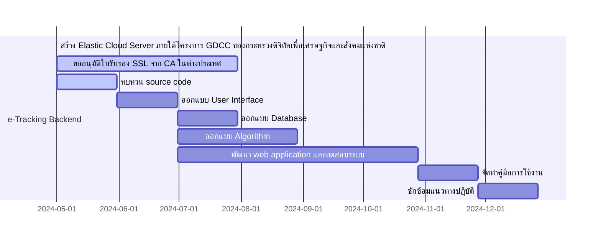
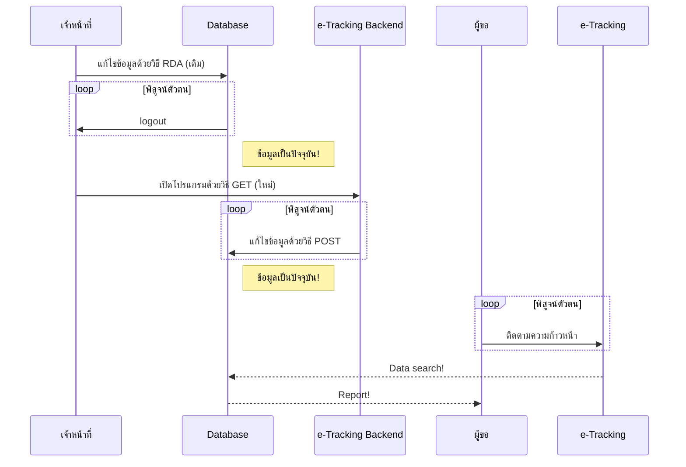

#  โครงการพัฒนาระบบ e-Tracking Backend
## หลักการและเหตุผล
เพื่อให้การแจ้งสถานะคำขอข้อมูลข่าวสารของ สป.ทส. เป็นไปอย่างถูกต้อง รวดเร็ว สะดวก และมั่นคงปลอดภัยมากขึ้น จำเป็นต้องมีระบบ backend สำหรับใช้ในการปรับปรุงฐานข้อมูลสถานะคำขอข้อมูลข่าวสาร จึงจัดทำโครงการนี้ในปีงบประมาณ พ.ศ. 2568 เพื่อพัฒนาโปรแกรม e-tracking backend เที่มีความสะดวก รวดเร็ว มั่นคง และปลอดภัยในการใช้งาน

## วัตถุประสงค์
1. พัฒนาระบบ e-Tracking Backend เป็น e-service ประเภท Web Application
2. พัฒนาระบบจัดการสิทธิ์ผู้ใช้ โดยมีระบบแจ้งรหัส OTP แก่ผู้ใช้งาน
   
## แผนการดำเนินงาน

## วิธีการดำเนินงาน
1. ทบทวน source code ของโปรแกรม e-Tracking ที่เชื่อมต่อกับระบบ e-Request
2. ออกแบบกลไกการทำงาน ดังนี้

4. ออกแบบ

## งบประมาณ
ค่าจัดซื้อใบรับรองความปลอดภัย Secure Socket Layer (SSL) อายุ 1 ปี วงเงิน 5,000 บาท
> [!NOTE]
> ไม่มีค่าจ้างที่ปรึกษาหรือโปรมแกรมเมอร์ เนื่องจากบุคลากรภายในสามารถทำหน้าทีเป็นนักพัฒนาโปรแกรมเต็มรูปแบบ (Full Stack Developer) ประกอบกับมีแหล่งเรียนรู้ออนไลน์จำนวนมาก ที่สามารถประยุกต์ใช้ได้

>[!WARNING]
>มีการนำเข้าข้อมูลส่วนบุคคลของผู้ยื่นคำขอ จึงต้องมีมาตรการรักษาความปลอดภัยของข้อมูลที่ได้มาตรฐานสากล

>[!TIP]
>ควรใช้มาตรการหลายชั้น เช่น
>- ใช้อุปกรณ์และเครือข่ายที่ได้รับการรับรองมาตรฐาน เช่น Elastic Cloud Server ของกระทรวงดิจิทัลเพื่อเศรษฐกิจและสังคมแห่งชาติ
>- รักษาความปลอดภัยในการรับส่งข้อมูลผ่านระบบอินเตอร์เน็ตแบบ Secure Socket Layer โดยได้รับใบรับรอง SSL จากผู้ออกใบอนุญาตในต่างประเทศ
>- เข้ารหัสข้อมูลส่วนบุคคลด้วย hash algorithm ที่ทันสมัย ยังไม่มีการเจาะข้อมูลได้ด้วยเทคโนโลยีในปัจจุบัน
>- เขียนโปรแกรมโดยเจ้าหน้าที่ของรัฐที่มีหน้าที่รับผิดชอบ เพื่อลดจำนวนบุคคลที่อาจล่วงรู้ถึงการประมวลผลข้อมูลส่วนบุคคล ป้องกันความเสี่ยงจากการละเมิดข้อมูลส่วนบุคคลโดยโปรแกรมเมอร์ที่หน่วยงานว่าจ้าง
>- เก็บรวบรวมข้อมูลส่วนบุคคลให้น้อยที่สุด

>[!NOTE]
>คุณสมบัติของระบบที่จะพัฒนา
>- เป็นระบบ backend ที่ทำงานผ่านเว็บบราวเซอร์ในลักษณะ open stack
>- มีระบบจัดการสมาชิก การตรวจสอบความถูกต้องของชื่อผู้ใช้และรหัสผ่านก่อนอนุญาตให้เข้าใช้งาน
>- เขียนด้วยภาษาฝั่งแม่ข่าย คนทั่วไปไม่สามารถตรวจดูรหัสต้นฉบับที่สำคัญได้
>- มี e-form สำหรับรับข้อมูลความคืบหน้าและส่งไปยังเครื่องแม่ข่ายของโปรแกรม
>- มีคู่มือการใช้งาน นโยบายความเป็นส่วนตัว
>- ติดตั้งและทำงานบนเครื่องแม่ข่ายในระบบคลาวด์กลางภาครัฐทุกวัน ตลอด 24 ชั่วโมง
>- ผู้ใช้ไม่ต้องเข้าถึงเครื่องแม่ข่ายผ่านระบบ open stack ของกระทรวงดิจิทัลเพื่อเศรษฐกิจและสังคมแห่งชาติ
>- รักษาความปลอดภัยของการส่งข้อมูลผ่านเว็บบราวเซอร์แบบ Secure Socket Layer
>- รองรับการใช้งานบนอุปกรณ์ที่หลากหลาย ทั้งระบบ Windows, Android และ iOS
>- มี user interface ตามมาตรฐานการพัฒนาแอพพลิเคชันภาครัฐของสำนักงานพัฒนารัฐบาลดิจิทัล (องค์การมหาชน)

## การทำงานของโปรแกรม
1. หน้าแรก คือ index.php เป็นหน้ารับข้อมูลจากเจ้าหน้าที่ มีช่องรับข้อมูล (input) จำนวน 3 ช่อง ได้แก่
    - nid ใช้รับข้อมูลหมายเลขประจำตัวประชาชนของผู้ขอข้อมูลข่าวสาร เป็น number
    - progress ใช้รับข้อมูลความคืบหน้า เป็น text
    - OTP ใช้นำรับข้อมูลรหัสผ่านของเจ้าหน้าที่ผู้รายงานความคืบหน้า
    มีปุ่ม submit เพื่อส่งข้อมูลไปยังไฟล์แสดงผล updateResult.php
    มีปุ่ม Forget OTP? สำหรับนำไปหน้า getOTP.html เพื่อขอ OTP จากระบบ e-Tracking Backend
2. หน้าขอรหัสผ่าน getOTP.html มีช่องรับข้อมูล จำนวน 1 ช่อง คือ email ใช้รับ email address ของหน่วยงานที่ดูแลระบบ e-Tracking
   - กรณีกรอกอีเมลไม่ถูกต้อง ระบบจะแจ้งผู้ใช้ว่า :
     > _ERROR 001 Wrong Email Address_
     และมีปุุ่มให้กด เพื่อกลับไปยังหน้าเดิม getOTP.html
   - กรณีกรอกอีเมลถูกต้อง ระบบจะดำเนินการ ดังนี้
     1) ออกรหัสผ่าน โดยใช้ข้อมูลวันที่วันนี้ เข้ารหัสด้วย hash algorithm แล้วตัดรหัสให้สั้นลง 
     2) ส่งรหัสผ่านไปยังอีเมลของหน่วยงานที่ดูแลระบบ e-Tracking ด้วยวิธี POST ผ่าน App Script ที่เขียนด้วย javascript และ deploy ด้วย Email account ของ Developer
>[!WARNING]
>รหัสผ่านเป็น One Time Passcode มีอายุการใช้งาน 1 วัน
    
3. หน้าแสดงผล updateResult.php
   - กรณีกรอก OTP ไม่ถูกต้อง และกด submit ระบบจะเตือนว่า _ERROR 002 Wrong OTP_
   - กรณีกรอกข้อมูลถูกต้องครบถ้วน แล้วกด submit ระบบจะแจ้งว่า
     > _ปรับปรุงข้อมูลสำเร็จ_
     และแสดงรายละเอียดข้อมูลที่ปรับปรุง รวมถึงหมายเลขประจำตัวประชาชนของผู้ขอที่ปิดบังตัวเลขหลายหลักด้วยเครื่องหมาย ***
4. เจ้าหน้าที่สามารถตรวจสอบผลการปรับปรุงข้อมูลที่ https://esc.mnre.go.th/app/e-tracking/

# อัลกอลิทึมที่สำคัญ
1. App Script: MailApp.sendEmail
3. htmlspecilcharacters
4. W3.CSS
5. Full stack hash
6. Form validation
7. Database design
8. Array
9. javascript loop
10. SSL Certificate

# ปัจจัยสำคัญ
ผู้พัฒนาเป็น programmer ประเภท Full Stack Developer ออกแบบและพัฒนาทั้งระบบ frontend และระบบ backend โดยใช้ความรู้และทักษะ
1. English
2. การสร้าง Elastic Cloud Server แบบ Web Sever
3. การติดตั้งโปรแกรม Apache และ PHP บนเครื่องแม่ข่าย
4. การติดตั้ง SSL Certificate ที่อนุมัติโดย CA ในต่างประเทศ
5. การพัฒนา Web App ด้วยภาษา HTML/CSS/javascript/PHP/App Script
6. สมาธิ จินตนาการ ความคิดสร้างสรรค์ ความเพียร ความรักในงาน 
